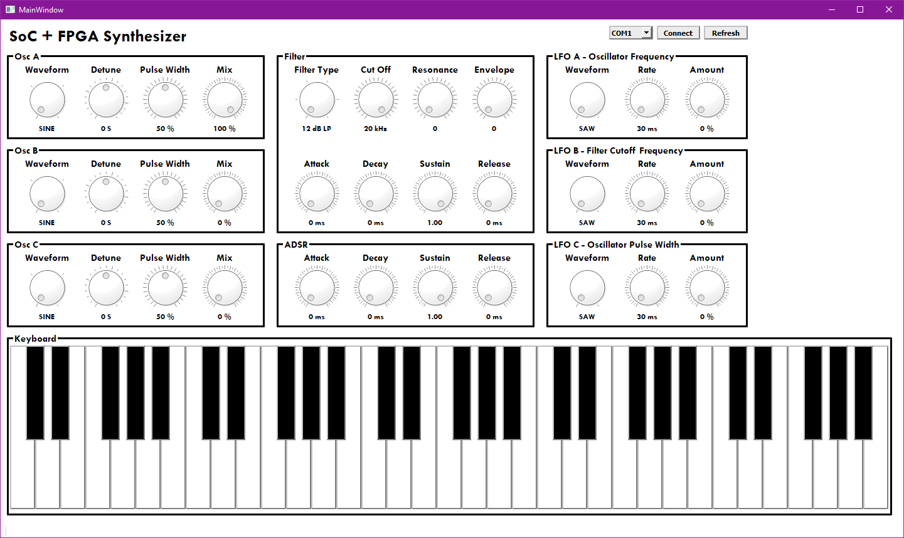

# Qt Synthesizer Interface
This repository contains the Qt project files for an application designed to communicate via UART with a digital music synthesizer implemented on a Zynq Soc+FPGA. The application provides controls for the configuration of the synthesizer's modules as well a keyboard with 5 octaves. Currently the interface is configured to have controls for three oscillators, two ADSR envelope generators, a Moog ladder filter and a three low frequency oscillators (LFO).

## Interface

